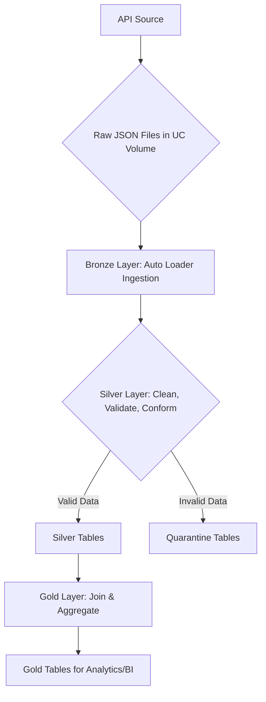

# Repository Structure and Architecture

## End-to-End Concept

The platform implements a lakehouse pipeline using the **Medallion Architecture** to progressively refine data into high-value analytical assets.

* **Raw Landing**: Data is fetched from the Lufthansa API and stored as raw JSON files within a Unity Catalog (UC) managed volume. This preserves the original source data indefinitely.
* **Bronze Layer**: Raw JSON files are ingested into bronze tables using Databricks Auto Loader. Each record is stored as a JSON string, enriched with metadata like the source file path and ingestion timestamp. This provides a durable, queryable archive of all ingested data.
* **Silver Layer**: The JSON data from the bronze tables is parsed, cleaned, and conformed. Data quality rules are applied to validate records. Invalid records are routed to quarantine tables for inspection, while valid records are loaded into structured, query-optimized silver tables.
* **Gold Layer**: Silver tables are joined and aggregated to create denormalized, business-centric views. These gold tables are designed for specific analytical use cases, reporting, and dashboarding, providing key performance indicators (KPIs) and business insights.

## Deployment Architecture

The entire project is packaged and deployed as a **Databricks Bundle**, enabling declarative infrastructure-as-code and CI/CD automation.

* `databricks.yml`: The core bundle file that defines workspace targets (`dev`, `prod`), permissions, and points to all other project resources.
* `resources/jobs/*.yml`: Defines multi-task orchestration jobs. For example, `orchestrate_pipeline_bronze_to_gold.yml` defines the sequence of running the bronze, silver, and gold tasks.
* `resources/pipelines/*.yml`: Defines the Declarative Pipelines (DLT) for the bronze and silver layers, specifying notebook paths, target schemas, and configurations.

## Medallion Mapping to Repository Artefacts

### Raw Landing

* **Code**: `src/extract_data/main.py`, `src/extract_data/config.py`
* **Storage**: UC Managed Volume `data_catalog.bronze.bronze_volume`
* **Paths**:
  * `.../operations/flightstatus/departures/<AIRPORT_CODE>/<DATE>/<TIME_BLOCK>/*.json`
  * `.../reference/<ENTITY_TYPE>/*.json` (e.g., cities, countries)

### Bronze Layer

* **Code**:
  * `src/extract_data/bronze_table_flight_departures.py`
  * `src/extract_data/bronze_table_resources.py`
* **Tables**:
  * `bronze.bronze_departures`
  * `bronze.bronze_table_{cities, countries, airports, airlines, aircrafts}`

### Silver Layer

* **Code**:
  * `src/silver/silver_tables_departure.py`
  * `src/silver/silver_tables_{cities, countries, airports, etc}.py`
* **Outputs**:
  * `silver.silver_departures`
  * `silver.silver_departures_quarantine`
  * `silver.silver_table_{cities, countries, airports, etc}`

### Gold Layer

* **Code**: `src/gold/gold_service_by_country.py`
* **Table**: `gold.gold_flight_details`

## Data Flow Diagram



## Key Design Choices

* **Decoupled Ingestion**: Storing raw API payloads as files in a volume decouples the data extraction process from the data transformation pipelines.
* **Schema Resilience**: Ingesting to a bronze table with the raw JSON as a string makes the pipeline resilient to upstream schema changes.
* **Explicit Data Quality**: Using expectations and quarantine tables makes data quality issues explicit, measurable, and debuggable without halting the entire pipeline.
* **Declarative Pipelines**: Using Databricks Pipelines (DLT) simplifies the development and management of the bronze and silver layers.

```#
# Repository Structure and Architecture

## End-to-End Concept

The platform implements a lakehouse pipeline using the **Medallion Architecture** to progressively refine data into high-value analytical assets.

*   **Raw Landing**: Data is fetched from the Lufthansa API and stored as raw JSON files within a Unity Catalog (UC) managed volume. This preserves the original source data indefinitely.
*   **Bronze Layer**: Raw JSON files are ingested into bronze tables using Databricks Auto Loader. Each record is stored as a JSON string, enriched with metadata like the source file path and ingestion timestamp. This provides a durable, queryable archive of all ingested data.
*   **Silver Layer**: The JSON data from the bronze tables is parsed, cleaned, and conformed. Data quality rules are applied to validate records. Invalid records are routed to quarantine tables for inspection, while valid records are loaded into structured, query-optimized silver tables.
*   **Gold Layer**: Silver tables are joined and aggregated to create denormalized, business-centric views. These gold tables are designed for specific analytical use cases, reporting, and dashboarding, providing key performance indicators (KPIs) and business insights.

## Deployment Architecture

The entire project is packaged and deployed as a **Databricks Bundle**, enabling declarative infrastructure-as-code and CI/CD automation.

*   `databricks.yml`: The core bundle file that defines workspace targets (`dev`, `prod`), permissions, and points to all other project resources.
*   `resources/jobs/*.yml`: Defines multi-task orchestration jobs. For example, `orchestrate_pipeline_bronze_to_gold.yml` defines the sequence of running the bronze, silver, and gold tasks.
*   `resources/pipelines/*.yml`: Defines the Declarative Pipelines (DLT) for the bronze and silver layers, specifying notebook paths, target schemas, and configurations.

## Medallion Mapping to Repository Artefacts

### Raw Landing
*   **Code**: `src/extract_data/main.py`, `src/extract_data/config.py`
*   **Storage**: UC Managed Volume `data_catalog.bronze.bronze_volume`
*   **Paths**:
    *   `.../operations/flightstatus/departures/<AIRPORT_CODE>/<DATE>/<TIME_BLOCK>/*.json`
    *   `.../reference/<ENTITY_TYPE>/*.json` (e.g., cities, countries)

### Bronze Layer
*   **Code**:
    *   `src/extract_data/bronze_table_flight_departures.py`
    *   `src/extract_data/bronze_table_resources.py`
*   **Tables**:
    *   `bronze.bronze_departures`
    *   `bronze.bronze_table_{cities, countries, airports, airlines, aircrafts}`

### Silver Layer
*   **Code**:
    *   `src/silver/silver_tables_departure.py`
    *   `src/silver/silver_tables_{cities, countries, airports, etc}.py`
*   **Outputs**:
    *   `silver.silver_departures`
    *   `silver.silver_departures_quarantine`
    *   `silver.silver_table_{cities, countries, airports, etc}`

### Gold Layer
*   **Code**: `src/gold/gold_service_by_country.py`
*   **Table**: `gold.gold_flight_details`

## Data Flow Diagram


## Key Design Choices

* **Decoupled Ingestion**: Storing raw API payloads as files in a volume decouples the data extraction process from the data transformation pipelines.
* **Schema Resilience**: Ingesting to a bronze table with the raw JSON as a string makes the pipeline resilient to upstream schema changes.
* **Explicit Data Quality**: Using expectations and quarantine tables makes data quality issues explicit, measurable, and debuggable without halting the entire pipeline.
* **Declarative Pipelines**: Using Databricks Pipelines (DLT) simplifies the development and management of the bronze and silver layers.
